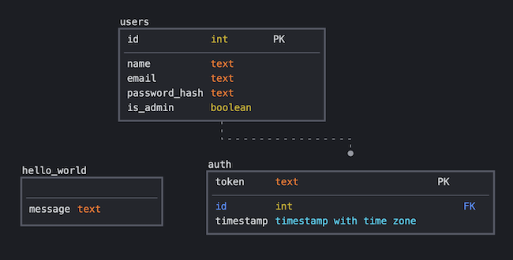

# Database

## Purpose
The database holds basic information needed to access our website. At the moment, this only pertains to login related work, as much of the data handling is done using an external blockchain tool.

## Design
See the schema design below. The hello_world table exists solely for testing purposes. User passwords will be stored as a salted md5 hash.  
  

## Test User
The test user's information can be found below:  
Name: John Smith  
Email: johnsmithcs98health@gmail.com  
Password: password  
Is_Admin: False  
  
  
The login information for the test user's gmail account is:  
Email: johnsmithcs98health@gmail.com  
Password: cs98health!

## Example Commands
Replace the question mark with the relevant data. Be sure to prevent SQL injection and to properly hash passwords.

### Validating Log In
Will return nothing if email & password is incorrect, or user data if it is correct.  
`SELECT * FROM users WHERE email=? and password_hash=?;`

### Getting User Info by ID
`SELECT * FROM users WHERE id=?;`

### Creating User
Order of fields: id, name, email, password_hash, is_admin  
`INSERT INTO users VALUES (DEFAULT, ?, ?, ?, ?);`

### Changing User Info
`UPDATE users SET name = ?, email = ?, password_hash = ?, is_admin = ? WHERE id = ?;`

### Removing User
`DELETE FROM users WHERE id=?;`

## Author
Scott Crawshaw '22
