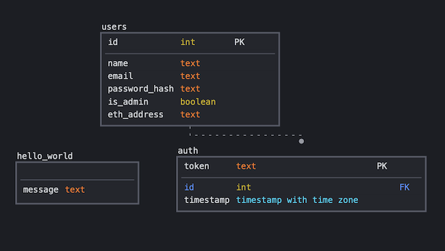

# Database

## Purpose
The database holds basic information needed to access our website. At the moment, this only pertains to login related work, as much of the data handling is done using an external blockchain tool.

## Design
See the schema design below. The hello_world table exists solely for testing purposes. User passwords will be stored as a salted md5 hash.  
  

## Test User
The test user's information can be found below:  
Name: John Smith  
Email: johnsmithcs98health@gmail.com  
Password: password  
Is_Admin: False  
  
  
The login information for the test user's gmail account is:  
Email: johnsmithcs98health@gmail.com  
Password: cs98health!

## Example Commands
TODO

## Author
Scott Crawshaw '22
